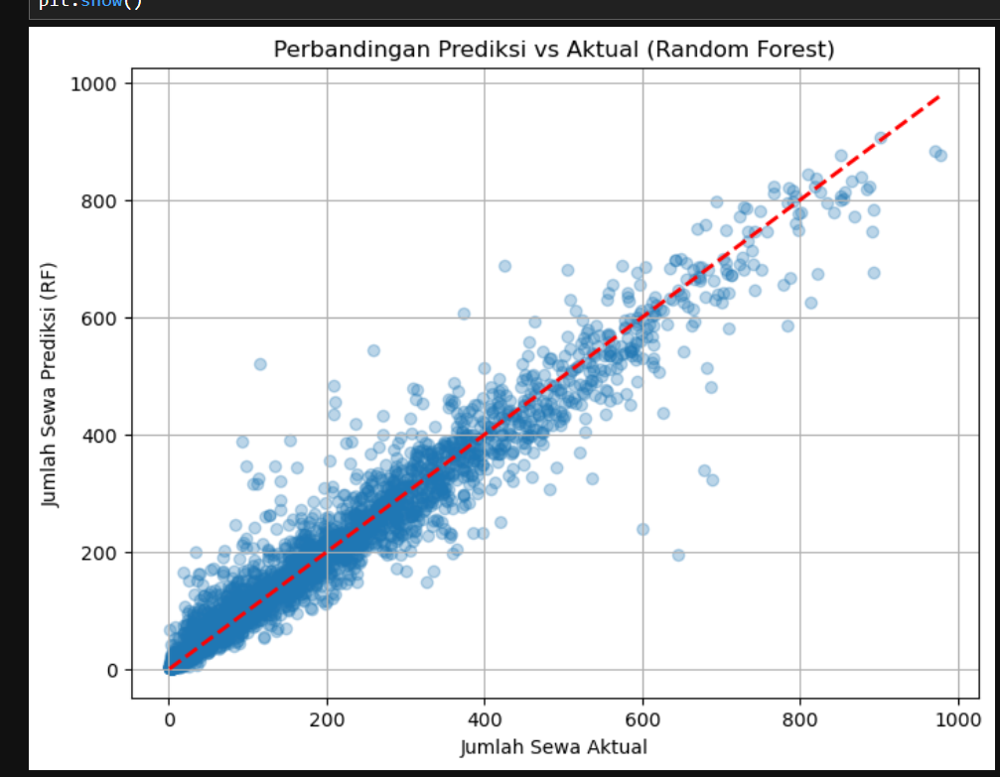
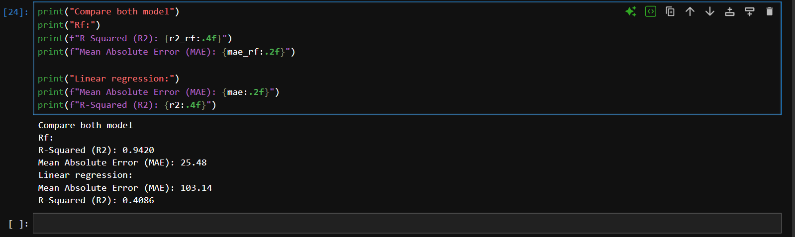
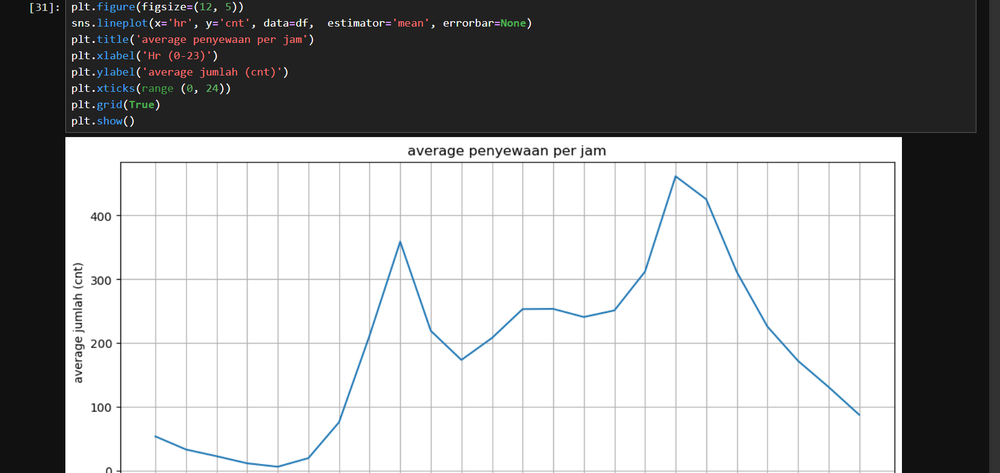

#  Bike Sharing Demand Prediction 

## Overview
Proyek ini bertujuan untuk memprediksi **jumlah total sepeda yang disewa per jam** berdasarkan data cuaca, waktu, dan kondisi hari. 
Model ini dapat digunakan oleh perusahaan penyewaan sepeda untuk mengoptimalkan distribusi sepeda agar tidak kehabisan stok di jam sibuk, serta mengurangi biaya perawatan di jam sepi.

## Tech Stack
- **Python 3**
- **Pandas & NumPy** (Pengolahan Data)
- **Matplotlib & Seaborn** (Visualisasi Data)
- **Scikit-learn** (Machine Learning)

**Grafik Perbandingan Prediksi vs Aktual (Random Forest):**

**Perbandingan Model Linear vs Random Forest:**

** EDA **

## Evaluation
Saya membandingkan dua model machine learning untuk melihat mana yang paling akurat:

| Model | MAE (Mean Absolute Error) | R-Squared (R2) |
| :--- | :--- | :--- |
| Linear Regression | 103.14 | 0.40 |
| **Random Forest (Best Model)** | **25.48** | **0.94** |

**Penjelasan:** Random Forest dipilih karena mampu menangkap pola non-linear (naik-turunnya jam sibuk pagi dan sore) yang gagal diprediksi oleh Linear Regression.

*(Sisipkan screenshot grafik evaluasi/model Anda di sini)*

## Business Insights
Dari analisis fitur (Feature Importance), ditemukan bahwa **Jam (hr)** dan **Suhu (temp)** adalah faktor paling dominan.

1. **Pola Komuter:** Terdapat lonjakan permintaan yang sangat tinggi pada jam **08.00 pagi** dan **17.00 sore** di hari kerja. *Rekomendasi:* Tambahkan stok sepeda ekstra pada jam-jam tersebut.
2. **Pengaruh Cuaca:** Saat hujan (weathersit = 3) atau suhu sangat dingin, jumlah penyewaan turun drastis. *Rekomendasi:* Kurangi stok atau alihkan sepeda ke perawatan (maintenance) pada hari hujan.
3. **Target Lanjutan:** Pada proyek ini, target yang digunakan adalah `cnt` (total). Untuk penelitian selanjutnya, model akan dipecah menjadi target `casual` (pengguna harian) dan `registered` (member) untuk memahami perilaku masing-masing.

